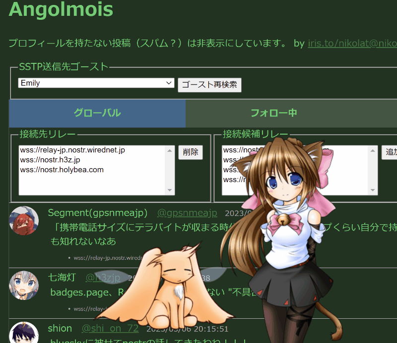

# angolmois-electron
Nostrリレーから投稿を取得して表示するWebアプリです。  
投稿を表示すると同時に伺か互換ベースウェア(SSTPサーバー)にSSTPを送信し、ゴースト(キャラクター)に投稿を喋らせます。  



## 何て読むの？
「アンゴルモア」と呼んでください。

## 使い方1
1. 下記のサイトから最新版のSSPをダウンロードしssp.exeを起動します。  
  [独立伺か研究施設 ばぐとら研究所](http://ssp.shillest.net/)
2. [アンゴルモア](https://nikolat.github.io/angolmois/)を開きます。
3. しばらくすると投稿が表示され、同時に起動しているゴーストが投稿内容を喋り出します。

### ゴースト側のカスタマイズ(伺か経験者向け)
angolmoisは[SSTP](http://ssp.shillest.net/ukadoc/manual/spec_sstp.html) over HTTPによりSSTPサーバーと通信を行います。  
angolmoisからは指定したゴーストに対して以下のようなSSTPが送信されます。
```
NOTIFY SSTP/1.1
Charset: UTF-8
Sender: angolmois-electron
Event: OnNostr
Option: nobreak
Script: \0おはノスー！\e
Reference0: Nostr/0.1
Reference1: おはノスー！
Reference2: nosuta
Reference3: のす太
Reference4: https://sample.com/avatar.png
```
ゴーストはOnNostrイベントに対して独自に[SakuraScript](http://ssp.shillest.net/ukadoc/manual/list_sakura_script.html)を応答することで通知内容をカスタマイズして表現することができます。  
以下に[YAYA](https://github.com/YAYA-shiori/yaya-shiori/wiki)による応答実装例を示します。  
```
OnNostr
{
	_protocol_version = reference[0]
	if _protocol_version != 'Nostr/0.1'
		return
	_note = reference[1]
	_name = reference[2]
	_display_name = reference[3]
	"\C\0\_q\f[bold,true]%(SHIORI3FW.EscapeAllTags(_display_name))\f[bold,default] /
		@%(SHIORI3FW.EscapeAllTags(_name))\n/
		%(SHIORI3FW.EscapeDangerousTags(_note))/
		\![set,trayballoon/
			,--text=%(AYATEMPLATE.EscapeText(_note))/
			,--title=%(AYATEMPLATE.EscapeText(_display_name))/
			,--icon=info]/
		\n\n\e"
	// \Cにより前回までの投稿の表示を維持し、
	// \_qにより以降の文字列をノーウェイトで一気に表示し、
	// \f[bold,true] ~ \f[bold,default]で名前を囲むことで名前を太文字で表示した後通常に戻し、
	// @付きでID名を表示し、\nで改行し、
	// 投稿内容を表示し、
	// \![set,trayballoon,...]でトースト通知を行い、
	// \n\nで改行2回の後、\eでえんいー。
}
```

### 他にカスタマイズ方法は？
音声読み上げプラグイン

- [apxxxxxxe/Bouyomi: 伺かプラグイン](https://github.com/apxxxxxxe/Bouyomi)

## 使い方2
Kind 9801 および 9821 を使用してSakura Scriptを流す[SSTP Bottle](http://bottle.mikage.to/)を模した実験的機能も付いています。

## 伺かって何？

- [ゴーストの使い方 - SSP](http://keshiki.nobody.jp/)
- [登場から早や20年、いまだに話題となるデスクトップマスコット「伺か」ってなに？ - やじうまの杜 - 窓の杜](https://forest.watch.impress.co.jp/docs/serial/yajiuma/1404090.html)
- [【紹介動画】How to 伺か - YouTube](https://www.youtube.com/watch?v=AFDqMiPHptc)

## What is Ukagaka?
- [What is an Ukagaka/Ghost? (or FLELE) - YouTube](https://www.youtube.com/watch?v=h0CHB2M5eAE)
